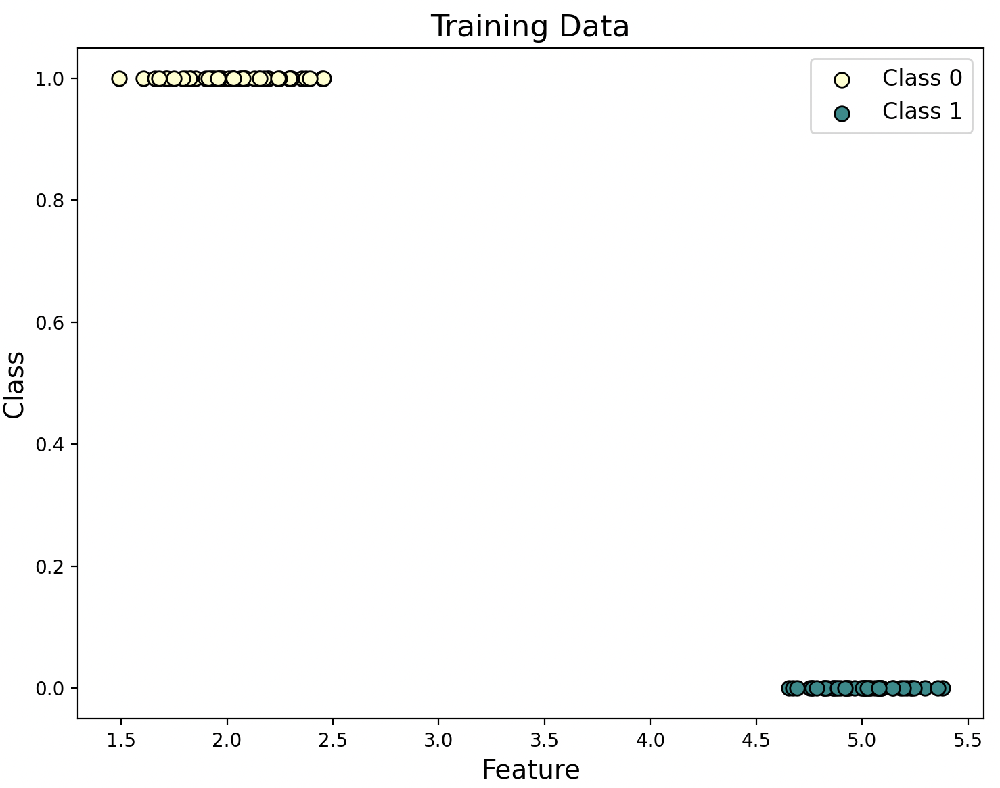
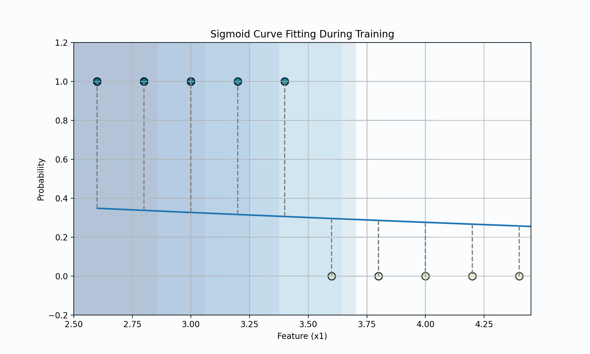
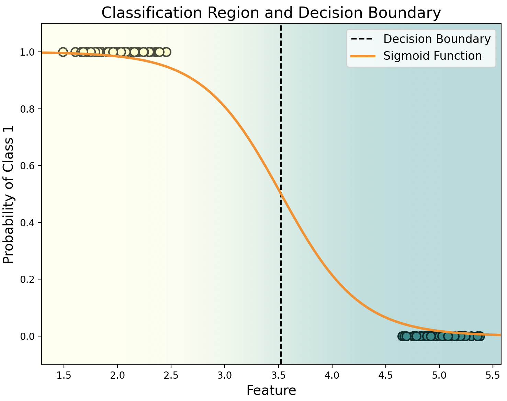
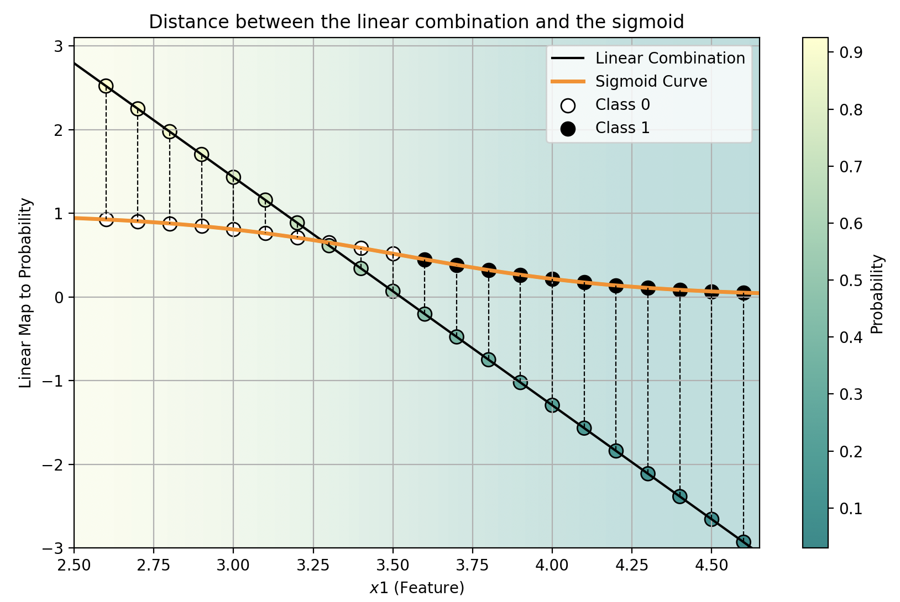
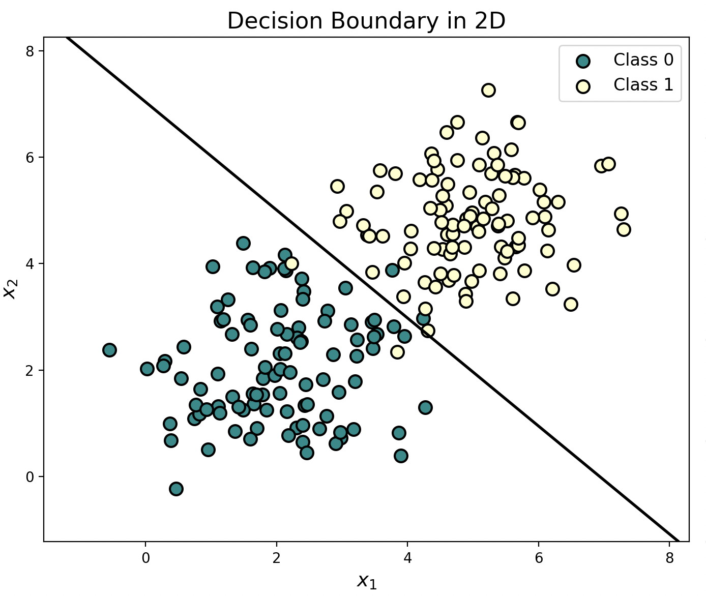
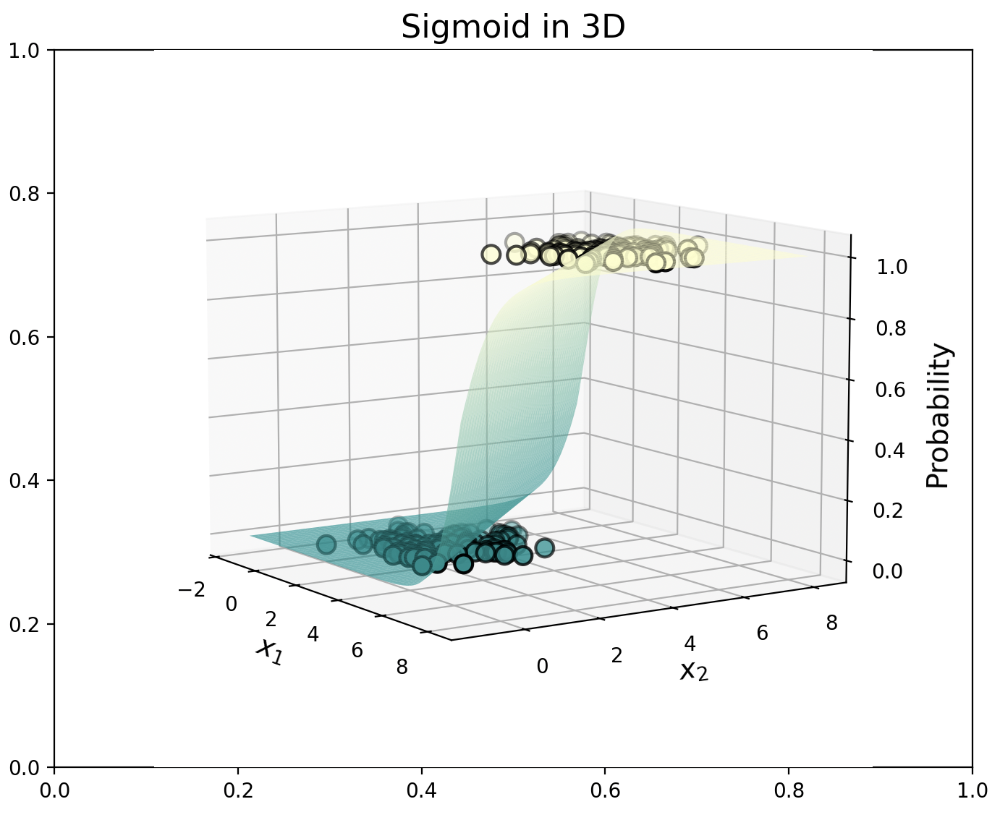

## Logistic Regression

Logistic regression is not a regression but rather a *classification learning algorithm*. The name originates from statistics, given that the mathematical formulation of logistic regression resembles that of linear regression. We still aim to *model* $y_i$ as a linear function of $x_i$, but with a binary $y_i$, this isn’t straightforward. The *linear combination of features* like $wx_i + b$ can *span from minus infinity to plus infinity*, while $y_i$ only has *two possible values*. 

If we define the *negative* label as $0$ and the **positive** label as $1$, we need a simple continuous function with a *codomain* of $(0,1)$. In this case, if the model's output for input $x$ is closer to $0$, we assign a *negative label* to $x$; otherwise, we assign a **positive label**. The **standard logistic function** (also known as the **sigmoid function**) has this property, providing us with the probability of belonging to one class:

$$g(z) = \frac{1}{1 + e^{-z}}$$

So the *logistic regression model* is represented as follows:

$$f_{\mathbf{w},b}(\mathbf{x}) = \frac{1}{1 + e^{-\mathbf{wx} + b}}$$

In essence, the regression model $f_{w,b}$ outputs *logits*, which are mapped between $0$ and $1$ by the sigmoid function. When the logits are large, $e^{-z}$ becomes a *small positive* number, making $1 / (\text{almost 1})$ close to 1, indicating a high probability. On the other hand, if the logit is a small (or negative) number, $e^{-z}$ becomes large, making $1 / (\text{large value})$ close to 0, indicating a low probability.

If we *optimize* the values of $w$ and $b$ appropriately, we can interpret the *output* of $f(x)$ as the *probability* of $y_i$ being *positive*. For example, if this probability is higher than or equal to a threshold of $0.5$ (or $50\%$), we classify $x$ as *positive*; otherwise, we classify it as **negative**. In practice, we are looking for the $b$ and $w$ values that produce the best line to separate our data, which is then mapped to probabilities.

**In practice, the choice of threshold may vary depending on the problem.**

---

We have the following data, belonging to just 2 classes:

We train our model, fitting the sigmoid curve:

When the model has finished, we obtain the following sigmoid curve and decision boundary

The mapping between the linear model and the sigmoid (logits to probability) will look like this:

With 2 features we will have somthing like this:

---

## Optimization

The optimization criterion in logistic regression is called *maximum likelihood* (likelihood defines how likely the observation is according to our model or parameters). Instead of minimizing the average loss, like in linear regression, we now *maximize the likelihood* of the training data according to our model.

$$L_{w,b} = \prod_{i=1}^m f_{w,b}(x_i)^{y_i} (1 - f_{w,b}(x_i))^{(1-y_i)}$$

This is just a mathematical way of saying $f_{w,b}(x)$ when $y_i = 1$ and $(1-f_{w,b}(x))$ otherwise. In the likelihood, the results that $f_{w,b}(x)$ yields are real, i.e., between $[0, 1]$, as it represents the multiplication of all probabilities.

Because of the exponential function used in the model and the products involved, in practice, to avoid numerical overflow, it’s more convenient to *maximize the log-likelihood* instead of likelihood. The *log-likelihood* is defined as follows:

$$L_{w,b}(\mathbf{x}) = \frac{1}{m}\sum_{i=1}^{m} \left[y_i \log f_{w,b}(\mathbf{x_i}) + (1 - y_i) \log \left(1 - f_{w,b}(\mathbf{x_i})\right)\right]$$

But *maximizing* a *loss* seems counterintuitive, so we can take the **negative log-likelihood** (multiplying by -1), which is very similar to **cross-entropy**. These are often used interchangeably and yield the following loss function:

$$L_{w,b}(\mathbf{x}) = -\frac{1}{m}\sum_{i=1}^{m} \left[y_i \log f_{w,b}(\mathbf{x_i}) + (1 - y_i) \log \left(1 - f_{w,b}(\mathbf{x_i})\right)\right]$$

So:

$$L_{w,b}(\mathbf{x}) = \begin{cases} 
1\cdot\log(f_{w,b}(\mathbf{x})) & \text{if } y=1
(1-0)\log(1-f_{w,b}(\mathbf{x})) & \text{if } y=0
\end{cases}$$

- In the first case, if the *prediction* is $1$ (**correct**) $\rightarrow\log(1)=0$.
- In the second case, if the *prediction* is $0$ (**correct**) $\rightarrow\log(1-0)=0$

### Multi-class Classification

The above formula represents *log-loss*, which is also the same as *cross-entropy* and *negative log-likelihood*, and is adapted for binary classification. The *original* formula, used for *multi-class classification*, is as follows:

$$H(P,Q) = -\sum_{i=1}^{m} P(x_i) \cdot \log(Q(x_i))$$

We can adapt this for coding as follows:

$$\frac{-1}{m} \sum_{i=1}^{m} \sum_{j=1}^{n} y_{i,j} \log(P(y_{i,j}^{\text{predicted}} = y_{i,j}^{\text{real}}))$$

Where $y^{\text{real}}$ is a matrix of *One-Hot encoding* for the classes or the probability of belonging to the real classes (the probabilities can just be 1 or 0 for the real ones), so we are only summing up the probabilities of belonging to the *real class*.

In logistic regression, we cannot directly perform multi-class classification using the *sigmoid function*, as it only works for binary classification. However, we can handle multi-class classification by using a **One-vs-All** approach, where we train a separate classifier for each class. Alternatively, we can use the **softmax** function, which provides probabilities across multiple classes, making it ideal for multi-class classification.

$$\text{softmax}(z) = \frac{\exp(z_i)}{\sum_{j=1}^C\exp(z_j)}$$

Where:

- $z_i$ is the *logit* of class $i$
- $z_j$ is the *logit* of class $j$

Thus, the softmax gives us the *probability of belonging to each class*, providing $c$ probabilities.
